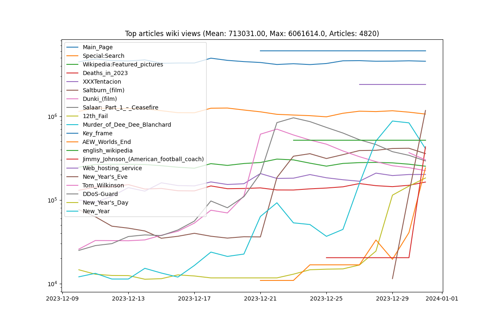

# Задание

## Описание
Предоставленный скрипт извлекает статистику просмотров 1000 лучших страниц английской Википедии за каждую дату в пределах указанного диапазона дат.
Затем он обрабатывает данные и генерирует график, иллюстрирующий изменения популярности страниц с течением времени.
Пример запуска, который позволит создать график: 

## Задача
Ваша задача - улучшить этот скрипт. Критериями являются простота и надежность.

## Запуск тестового кода
```bash
# Для macos
python -m venv .venv
source .venv/bin/activate
pip inatall -r requirements.txt
python sample_code.py 20231210 20231231
```

## Получаем изображение сформированое тестовым кодом


## Запуск готового кода
```bash
python refactoring_code.py 20231210 20231231
```
## Получаем изображение сформированое готовым кодом
